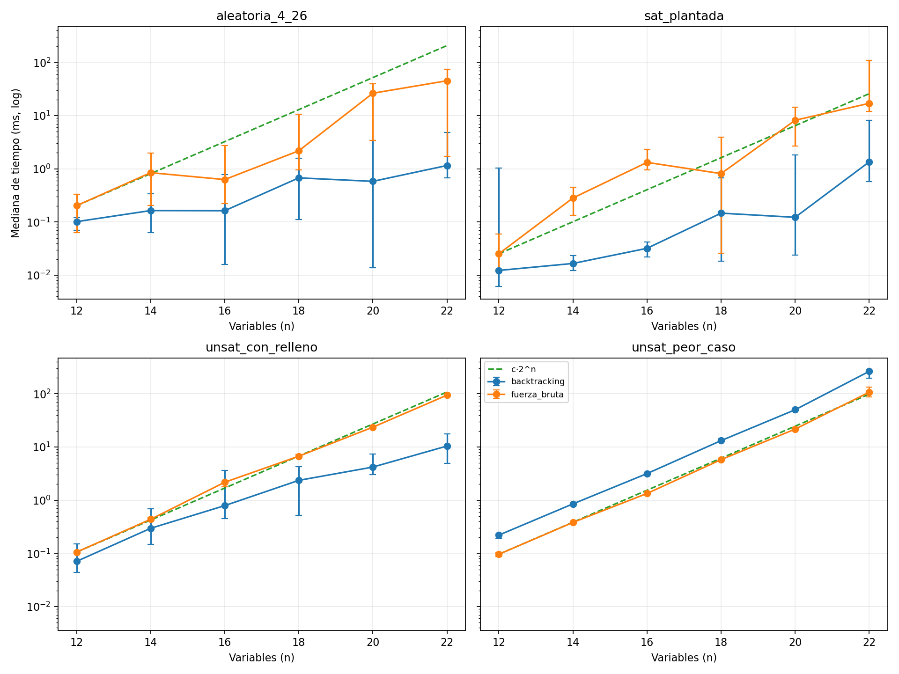
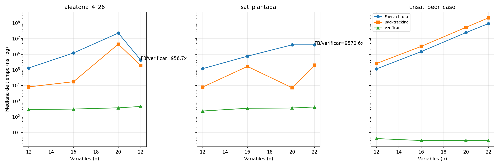
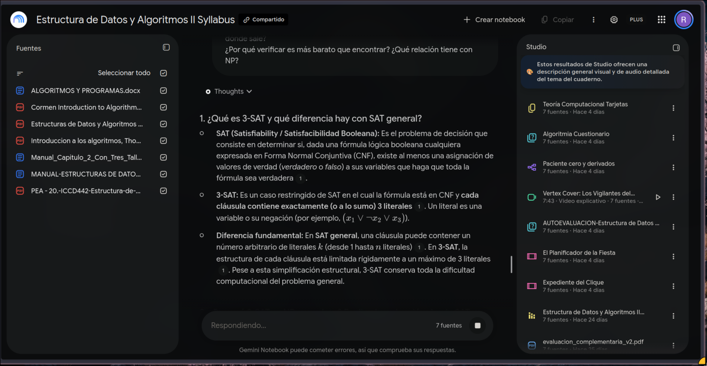
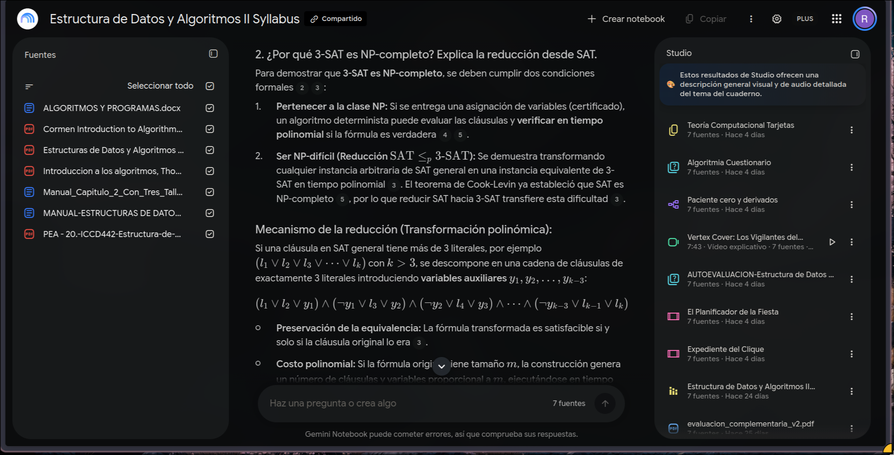
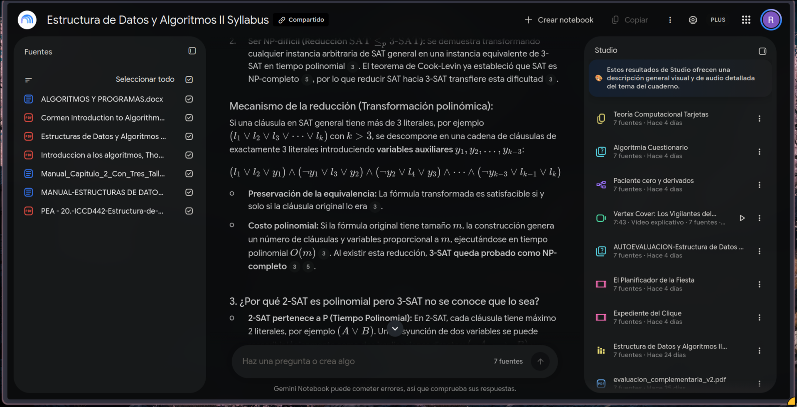
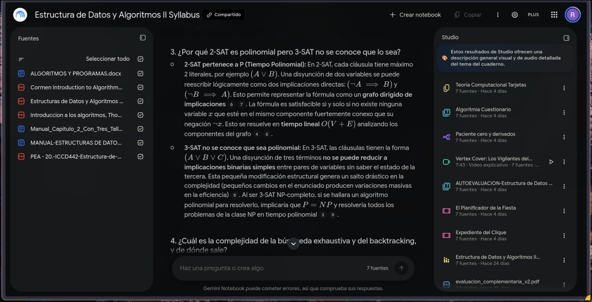

# Informe técnico — Tema 2: 3-SAT

## 1. Portada

**Nombres:** Alan Tingo, Carlos Rojas, Esteban Valenzuela, Ricardo Leon
Ingeniería en Ciencias de datos, [GR2CD], [fecha].  
Proyecto Integrador — Unidad 2: Complejidad Computacional.

## 2. Introducción

Este proyecto implementa un configurador de opciones compatibles como una
fórmula 3-CNF. Cada opción es una variable booleana y cada restricción es una
cláusula de tres posiciones. El sistema decide SAT/UNSAT y muestra una
configuración cuando existe.

## 3. Objetivos

Representar y validar fórmulas, resolverlas con fuerza bruta y backtracking,
comparar encontrar frente a verificar, contrastar 2-SAT y producir mediciones
reproducibles sin bibliotecas SAT externas.

## 4. Descripción del problema

Una instancia contiene n variables y m cláusulas. Los literales positivos
representan seleccionar una opción y los negativos excluirla. La consola
permite ingresar, cargar, generar, validar, resolver y comparar configuraciones.

## 5. Fundamentos teóricos

SAT pregunta si una fórmula booleana es satisfacible. 3-SAT exige exactamente
tres posiciones por cláusula y pertenece a NP porque una asignación se verifica
en tiempo lineal en m. Es NP-difícil porque toda cláusula de SAT se transforma
en cláusulas ternarias equisatisfacibles: las cortas se rellenan y las largas
usan variables auxiliares. Cook–Levin codifica computaciones no deterministas
como SAT y establece la completitud de SAT. 2-SAT, en cambio, se resuelve con
SCC en `Θ(n+m)`.

## 6. Diseño y pseudocódigo

La fuerza bruta recorre máscaras `0..2^n-1`; el backtracking asigna cada variable
y poda cuando una cláusula queda totalmente falsa. El verificador evalúa tres
literales por cláusula. Los pseudocódigos completos están en
`../diagramas/pseudocodigo/`.

## 7. Estructuras de datos

`Formula` usa una lista de arreglos de enteros; el signo codifica negación.
`Resultado` contiene SAT, certificado, nodos, hojas, tiempo y profundidad.
La máscara evita arreglos temporales por asignación. 2-SAT usa dos nodos por
variable y listas de adyacencia.

## 8. Implementación en Java

`formula-service` analiza y valida; `solver-service` implementa fuerza bruta,
backtracking, 2-SAT y reducción; `generator-service` crea familias; 
`benchmark-service` mide; `console-app` orquesta el menú. Todo compila con
`javac --release 17` y solo usa APIs del JDK.

## 9. Pruebas funcionales

La suite ejecuta 200 fórmulas pequeñas, 500 equivalencias 3-SAT, 200
comparaciones 2-SAT y 100 reducciones. También verifica repetición, tautología,
literal cero, rango, cláusulas inválidas y entrada no numérica.

## 10. Complejidad temporal y espacial

Validar y verificar cuestan `Θ(m)` en el peor caso. Fuerza bruta cuesta
`Θ(2^n·m)` y usa `O(n+m)`; backtracking tiene peor caso
`O(2^n·m)`, profundidad `≤n` y espacio adicional `O(n)`. 2-SAT cuesta
`Θ(n+m)`. La derivación completa está en `fase4_complejidad.md`.

## 11. Resultados experimentales y gráficas

El benchmark usa cinco repeticiones, calentamiento y familias aleatoria,
plantada y UNSAT peor caso. Las tablas se generan desde `../data/resultados/`.

## 12. Discusión

El resultado UNSAT peor caso recorre el árbol completo, mientras que instancias
SAT pueden terminar antes. Las diferencias entre mediciones se explican por
JIT, cachés y el orden de las cláusulas. La verificación pura excluye la
validación estructural para medir el costo del certificado.

## 13. Conclusiones

La implementación muestra experimentalmente que encontrar una asignación puede
ser exponencial, pero verificarla es lineal en las cláusulas. Backtracking
reduce nodos en muchas instancias, aunque conserva la cota exponencial.

## 14. Referencias

Cook (1971), Karp (1972), Sipser, Cormen et al., Garey–Johnson y
Davis–Logemann–Loveland. La lista bibliográfica se mantiene en
`../text/referencias.md`.

## 15. Anexo NotebookLM

### Pregunta 01

**¿Qué es 3-SAT y qué diferencia hay con SAT general?**

**Respuesta de NotebookLM:** La captura define SAT como la existencia de una
asignación que hace verdadera una fórmula en CNF y presenta 3-SAT como el caso
restringido en que cada cláusula contiene exactamente (o como máximo) tres
literales.

**Fuente citada:** Cuaderno compartido “Estructura de Datos y Algoritmos II
Syllabus”; marcador visible [1]; panel izquierdo con “ALGORITMOS Y
PROGRAMAS.docx”, “Cormen Introduction to Algorithm...” y “Estructuras de Datos
y Algoritmos ...”; página exacta no visible en la captura.

### Pregunta 02

**¿Por qué 3-SAT es NP-completo? Explica la reducción desde SAT.**

**Respuesta de NotebookLM:** Las capturas afirman que Cook–Levin estableció
que SAT es NP-completo y relacionan ese hecho con la reducción de SAT a 3-SAT.

**Fuente citada:** Cuaderno compartido “Estructura de Datos y Algoritmos II
Syllabus”; marcadores visibles [2], [3], [4] y [5]; panel izquierdo con
“ALGORITMOS Y PROGRAMAS.docx”, “Cormen Introduction to Algorithm...” y
“Estructuras de Datos y Algoritmos ...”; página exacta no visible en la captura.

### Pregunta 03

**¿Por qué 2-SAT es polinomial pero 3-SAT no se conoce que lo sea?**

**Respuesta de NotebookLM:** 2-SAT se modela como un grafo de implicaciones y
es satisfacible si ninguna variable `x` queda en la misma componente fuertemente
conexa que `¬x`. Se resuelve en tiempo lineal `O(V+E)`. Una cláusula de tres
literales no se reduce a implicaciones binarias; como 3-SAT es NP-completo, un
algoritmo polinomial implicaría `P=NP`.

**Fuente citada:** Cuaderno compartido “Estructura de Datos y Algoritmos II
Syllabus”; marcadores visibles [3], [5], [6] y [7]; panel izquierdo con
“ALGORITMOS Y PROGRAMAS.docx”, “Cormen Introduction to Algorithm...” y
“Estructuras de Datos y Algoritmos ...”; página exacta no visible en la captura.

### Pregunta 04

**¿Cuál es la complejidad de la búsqueda exhaustiva y del backtracking, y de
dónde sale?**

**Respuesta de NotebookLM:** La fuerza bruta cuesta `O(2^n)` u `O(n·2^n)`
porque enumera las `2^n` combinaciones y evalúa `n` elementos. El backtracking
tiene peor caso `O(2^n)` por su árbol de decisión binario con poda.

**Fuente citada:** Cuaderno compartido “Estructura de Datos y Algoritmos II
Syllabus”; marcadores visibles [10], [11] y [12]; panel izquierdo con
“ALGORITMOS Y PROGRAMAS.docx”, “Cormen Introduction to Algorithm...” y
“Estructuras de Datos y Algoritmos ...”; página exacta no visible en la captura.

### Pregunta 05

**¿Por qué verificar es más barato que encontrar? ¿Qué relación tiene con NP?**

**Respuesta de NotebookLM:** Encontrar puede explorar `2^n` posibilidades,
mientras verificar recibe un certificado y comprueba sus cláusulas; la captura
relaciona esto con la definición de NP.

**Fuente citada:** Cuaderno compartido “Estructura de Datos y Algoritmos II
Syllabus”; marcadores visibles [4], [9] y [10]; panel izquierdo con “ALGORITMOS
Y PROGRAMAS.docx”, “Cormen Introduction to Algorithm...” y “Estructuras de
Datos y Algoritmos ...”; página exacta no visible en la captura.

### Registro

| N.º | Pregunta | Respuesta NotebookLM | Fuente/página | ¿Coincide con nuestro análisis? | Observaciones | Captura |
|---|---|---|---|---|---|---|
| 1 | ¿Qué es 3-SAT y qué diferencia hay con SAT general? | SAT decide si existe una asignación que hace verdadera una fórmula CNF; 3-SAT restringe cada cláusula a exactamente o como máximo tres literales, mientras SAT general admite un número arbitrario. | Cuaderno compartido “Estructura de Datos y Algoritmos II Syllabus”; marcador [1]; panel: “Cormen Introduction to Algorithm...” y “ALGORITMOS Y PROGRAMAS.docx”; página no visible en la captura. | Sí, en lo esencial | La respuesta visible distingue SAT general y 3-SAT. | `anexo_notebooklm/capturas/pregunta1.png` |
| 2 | ¿Por qué 3-SAT es NP-completo? Explica la reducción desde SAT. | 3-SAT pertenece a NP y es NP-difícil mediante una reducción polinomial desde SAT; las cláusulas largas se transforman con variables auxiliares y se conserva la satisfacibilidad. | Cuaderno compartido “Estructura de Datos y Algoritmos II Syllabus”; marcadores [2], [3], [4], [5]; panel: “Cormen Introduction to Algorithm...” y “ALGORITMOS Y PROGRAMAS.docx”; página no visible en la captura. | Sí, en lo esencial | La captura presenta las dos condiciones y el mecanismo de transformación. | `anexo_notebooklm/capturas/pregunta2.png`, `pregunta2_parte2.png` |
| 3 | ¿Por qué 2-SAT es polinomial pero 3-SAT no se conoce que lo sea? | 2-SAT usa un grafo de implicaciones y SCC: es satisfacible si `x` y `¬x` no están en la misma componente, en `O(V+E)`. Una cláusula de tres literales no se reduce a implicaciones binarias; un algoritmo polinomial para 3-SAT implicaría `P=NP`. | Cuaderno compartido “Estructura de Datos y Algoritmos II Syllabus”; marcadores [3], [5], [6], [7]; panel: “Cormen Introduction to Algorithm...” y “ALGORITMOS Y PROGRAMAS.docx”; página no visible en la captura. | Sí, en lo esencial | El resumen sigue los puntos legibles de la captura. | `anexo_notebooklm/capturas/pregunta3.png` |
| 4 | ¿Cuál es la complejidad de la búsqueda exhaustiva y del backtracking, y de dónde sale? | Fuerza bruta: `O(2^n)` u `O(n·2^n)` por enumerar las `2^n` combinaciones y evaluar `n` elementos. Backtracking: peor caso `O(2^n)` por el árbol binario con poda. | Cuaderno compartido “Estructura de Datos y Algoritmos II Syllabus”; marcadores [10], [11], [12]; panel: “Cormen Introduction to Algorithm...”; página no visible en la captura. | Sí, con distinto nivel de detalle | Compatible con fuerza bruta `Θ(2^n·m)` y `2^(n+1)−1` nodos de backtracking en el peor caso; nuestro análisis explicita además el costo de evaluar cláusulas. | `anexo_notebooklm/capturas/pregunta4.png` |
| 5 | ¿Por qué verificar es más barato que encontrar? ¿Qué relación tiene con NP? | Encontrar explora un espacio de hasta `2^n`; verificar recibe un certificado y realiza comprobaciones. La asimetría se relaciona con NP, donde verificar una respuesta afirmativa puede hacerse en tiempo polinomial. | Cuaderno compartido “Estructura de Datos y Algoritmos II Syllabus”; marcadores [4], [9], [10]; panel: “Cormen Introduction to Algorithm...” y “ALGORITMOS Y PROGRAMAS.docx”; página no visible en la captura. | Sí, en lo esencial | El resumen recoge la relación explícita con NP que aparece en la captura. | `anexo_notebooklm/capturas/pregunta5.png` |

### Contraste con fuentes

| Afirmación de NotebookLM | Fuente académica tomada de `text/referencias.md` | Conclusión del grupo | Discrepancias |
|---|---|---|---|
| 3-SAT es un caso restringido de SAT general. | Cormen et al., *Introduction to Algorithms*. | La captura distingue una fórmula CNF general de cláusulas de hasta tres literales. | Sin discrepancias relevantes. |
| La reducción SAT→3-SAT conserva satisfacibilidad y es polinomial. | Karp (1972), *Reducibility among combinatorial problems*. | La captura describe variables auxiliares, equivalencia y costo polinomial. | Sin discrepancias relevantes. |
| 2-SAT se resuelve con implicaciones y componentes fuertemente conexas, mientras 3-SAT no se conoce polinomial. | Cormen et al., *Introduction to Algorithms*. | La captura explica la diferencia estructural y relaciona 3-SAT con `P=NP`. | Sin discrepancias relevantes. |

### Reflexión grupal

NotebookLM nos ayudó a ordenar cinco respuestas sobre SAT, 3-SAT y complejidad.
En las capturas vimos que 3-SAT restringe el número de literales de cada
cláusula, que la reducción desde SAT usa variables auxiliares y que la
satisfacibilidad se conserva. También identificamos la explicación de 2-SAT
mediante un grafo de implicaciones y componentes fuertemente conexas, además de
la relación entre verificación, certificados y NP. La respuesta sobre búsqueda
exhaustiva y backtracking nos permitió distinguir la enumeración de `2^n`
combinaciones del árbol binario con poda. Las citas numéricas y los nombres
visibles en el panel ayudaron a ubicar el material, aunque las páginas exactas
no aparecen. No añadimos afirmaciones que no estuvieran legibles en las
capturas: cuando una formulación requería contexto, conservamos solo la idea
visible. Así aprendimos que una síntesis responsable debe separar lo que la
fuente muestra de lo que se podría inferir, y que las diferencias entre 2-SAT y
3-SAT dependen de la estructura de sus cláusulas. La herramienta sirvió como
apoyo de lectura, no como sustituto de nuestra revisión.

**Conteo de palabras de la reflexión:** 172.

Declaramos el uso de herramientas de IA (NotebookLM y asistente de código) como apoyo; el análisis y las conclusiones fueron revisados por el grupo.
